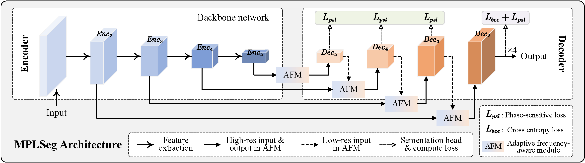

<!-- >  Code release for  MPLSeg -->

# MPLSeg

This is the official implementation of paper: [Decoupling Semantic and Localization for Semantic Segmentation via
Magnitude-aware and Phase-sensitive Learning](https://doi.org/10.1016/j.inffus.2024.102314). 



## * THIS REPO IS STILL UNDER CONSTRUCTION

## Requirements

Please install MMSegmentation(0.x) first, as per [MMSegmentation documentation](https://github.com/open-mmlab/mmsegmentation/blob/0.x/docs/en/get_started.md#installation).

```
# install mmsegmentation codebase
pip install -U opennmim
mim install mmcv-full
git clone -b 0.x https://github.com/open-mmlab/mmsegmentation.git
cd mmsegmentation
git checkout f67ef9
pip install -e .

# install MPLSeg code
git patch MPLSeg.patch
```

## Training

To train the model(s) in the paper, run this command (e.g., train a MPLSeg-ResNet18 on 4 GPUs):

```train
./dist_train.sh configs/mplseg/mplseg_resnet18_cityscapes.py 4
```

## Evaluation

To evaluate to trained models, run:

```eval
python demo/image_demo.py demo/demo.png configs/mplseg_resnet18_cityscapes.py weights/mplseg_resnet18_cityscapes.pth --device cpu --out-file result.jpg

```

<!-- ## Results

### Cityscapes

| Model           | mIoU | Download link |
| --------------- | ---- | ------------- |
| MPLSeg-ResNet18 | 78.1 | (Coming soon) |
| MPLSeg-ResNet101 | 82.6 | (Coming soon) |
| MPLSeg-SwinT | 79.4 | (Coming soon) |
| MPLSeg-SwinL | 83.1 | (Coming soon) |
| MPLSeg-ConvT | 79.5 | (Coming soon) |
| MPLSeg-ConvL | 83.3 | (Coming soon) |

### ADE20K

| Model           | mIoU | Download link |
| --------------- | ---- | ------------- |
| MPLSeg-ResNet18 | 40.9 | (Coming soon) |
| MPLSeg-ResNet101 | 47.9 | (Coming soon) |
| MPLSeg-SwinT | 46.7 | (Coming soon) |
| MPLSeg-SwinL | 54.0 | (Coming soon) |
| MPLSeg-ConvT | 47.3 | (Coming soon) |
| MPLSeg-ConvL | 54.5 | (Coming soon) |

### COCO-Stuff164K

| Model           | mIoU | Download link |
| --------------- | ---- | ------------- |
| MPLSeg-ResNet18 | 32.2 | (Coming soon) |
| MPLSeg-ResNet101 | 43.6 | (Coming soon) |
| MPLSeg-SwinT | 41.9 | (Coming soon) |
| MPLSeg-SwinL | 46.5 | (Coming soon) |
| MPLSeg-ConvT | 42.3 | (Coming soon) |
| MPLSeg-ConvL | 46.8 | (Coming soon) | -->


## Citation
If you find this work/repo helpful, please consider citing:
```
@ARTICLE{yan2024mplseg,
  author = {Qingqing Yan and Shu Li and Zongtao He and Xun Zhou and Mengxian Hu and Chengju Liu and Qijun Chen},
  title = {Decoupling semantic and localization for semantic segmentation via magnitude-aware and phase-sensitive learning},
  journal = {Information Fusion},
  pages = {102314},
  year = {2024},
  issn = {1566-2535},
  doi = {https://doi.org/10.1016/j.inffus.2024.102314},
  url = {https://www.sciencedirect.com/science/article/pii/S1566253524000927},
  }
```
